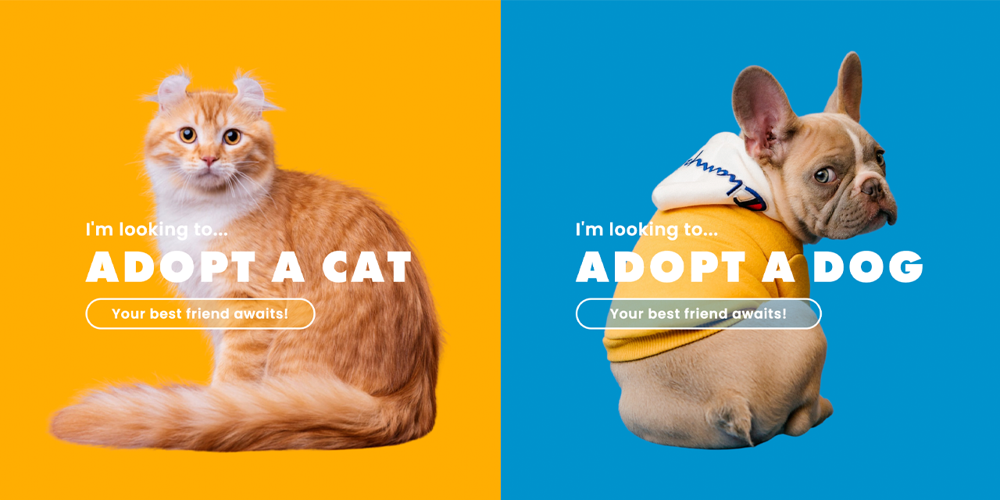

<p id="header"><p>

<table><tr>
<td> <a href="https://github.com/emjose/parallax-scroll/#header"></a> </td>
<td> <a href="https://github.com/emjose/one-hundred/#header"></a> </td>
<td> <a href="https://github.com/emjose/calculator-react/#header"></a> </td>
</tr></table>

<br>

<p id="project-title"><p>

<a href=#table-of-contents></a>

<br>

<a href="https://emjose.github.io/split-landing-page/"></a>

#

<p id="table-of-contents"><p>

<a href=#table-of-contents></a>

-   [100 Days of Code](#100days)
-   [Installation](#installation)
-   [Live Site](#live-site)
-   [Resources](#resources)
-   [Animal Rescue](#animal-rescue)
-   [Let's Connect!](#lets-connect)

#

<p id="100days"><p>

<a href=#100days></a>

### Day 18: February 25, 2021

-   I'm a proud <a href="https://www.instagram.com/cocodottie/">dog dad</a>, and I'm an advocate for animal rescue.

-   For Day 18, I made a split landing page with a pet adoption theme.

-   For this project, I used a free trial of <a href="https://www.canva.com/">Canva</a> to render transparent backgrounds for the images, and I also did some minor edits with <a href="https://www.google.com/aclk?sa=l&ai=DChcSEwiUscDUvNHvAhWJhMgKHfDpCEgYABAJGgJxdQ&ae=2&sig=AOD64_0apHaBpru1RH1_qzDgEM1z6rzddw&q&adurl&ved=2ahUKEwiR0LfUvNHvAhW8FVkFHQKHDd8Q0Qx6BAgEEAE">Adobe Photoshop</a>.

#

<p id="installation"><p>

<a href=#installation></a>

#### Git clone and cd into the repo folder:

```
git clone git@github.com:emjose/split-landing-page.git && cd split-landing-page
```

#### Run the command:

```
open index.html
```

#

<p id="live-site"><p>

<a href="https://emjose.github.io/split-landing-page/"></a>

<a href="https://emjose.github.io/split-landing-page/"></a>

#

<p id="resources"><p>

<a href=#resources></a>

-   #### [Canva](https://www.canva.com/)

-   #### [Unsplash](https://unsplash.com/)

-   #### [Google Fonts](https://fonts.google.com/)

-   #### [Adobe Photoshop](https://www.adobe.com/products/photoshop.html?sdid=KKQIN&mv=search&kw=photoshop&ef_id=CjwKCAjwr_uCBhAFEiwAX8YJgVeO0EDcnfVsroxAv6afMhKn7RYzXmRKIr2RbOnUHZhyO_2yv1-OTRoCwK0QAvD_BwE:G:s&s_kwcid=AL!3085!3!356475371248!e!!g!!adobe%20photoshop&gclid=CjwKCAjwr_uCBhAFEiwAX8YJgVeO0EDcnfVsroxAv6afMhKn7RYzXmRKIr2RbOnUHZhyO_2yv1-OTRoCwK0QAvD_BwE)

-   #### [Adobe Photoshop for Students](http://www.adobe-students.com/creativecloud/buy/students.html?kw=ps&sdid=KKTGX&mv=search&ef_id=CjwKCAjwr_uCBhAFEiwAX8YJgbZ5cqIOhkH_Te2PZ7my32Okk7Z0SCZUCy3tiejS5FvoKq9tpwbdDxoCPJoQAvD_BwE:G:s&s_kwcid=AL!3085!3!367440345311!e!!g!!adobe%20photoshop)

-   #### [Split Landing Page Tutorial 1](https://youtu.be/DvwP5Vz4y4Q) by [codicts](https://www.youtube.com/channel/UCItYqcz88SDtWMZ---R492g)

-   #### [Split Landing Page Tutorial 2](https://youtu.be/oRmQN244Ir0) by [Traversy Media](https://www.youtube.com/channel/UC29ju8bIPH5as8OGnQzwJyA)

-   #### [My blog on how I created my Github READMEs](https://emmanueljose.medium.com/readme-a-makeover-story-b9c7be37a6de?sk=7ae6623d365409d875753e4604e42ffd)

#

<p id="animal-rescue"><p>

<a href=#animal-rescue></a>

-   #### [Petfinder](https://www.petfinder.com/)

-   #### [Adopt a Pet](https://www.adoptapet.com/)

-   #### [The Shelter Pet Project](https://theshelterpetproject.org/)

-   #### [North Shore Animal League](https://www.animalleague.org/)

-   #### [ASPCA: The American Society for the Prevention of Cruelty to Animals®](https://www.aspca.org/)

#

<p id="lets-connect"><p>

<a href=#lets-connect></a>

<p><a href="https://twitter.com/Emmanuel_Labor"></a> <a href="https://www.linkedin.com/in/emmanuelpjose/"></a> <a href="https://emmanueljose.medium.com/"></a> <a href="https://www.instagram.com/emmanuel_jose/"></a> <a href="mailto:emjose@gmail.com"></a> <a href="https://www.emmanuel-jose.com/"></a> <a href="https://github.com/emjose"></a></p>

#

<a href=#header></a>
